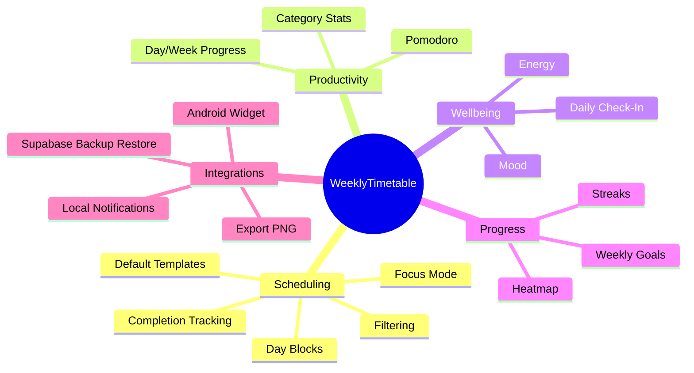
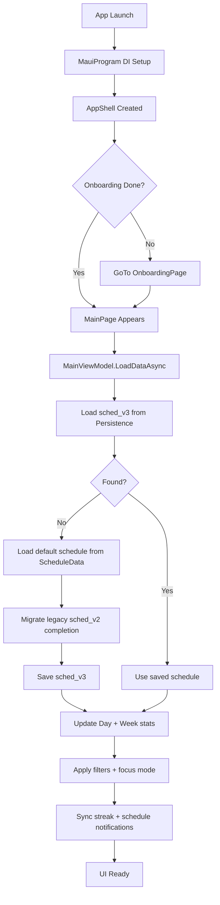

# Mindmap, Class Diagram, and Flow

## 1) Product/Domain Mindmap

```mermaid
mindmap
  root((WeeklyTimetable))
    Scheduling
      Default Templates
      Day Blocks
      Completion Tracking
      Filtering
      Focus Mode
    Productivity
      Pomodoro
      Category Stats
      Day/Week Progress
    Wellbeing
      Daily Check-In
      Energy
      Mood
    Progress
      Streaks
      Heatmap
      Weekly Goals
    Integrations
      Local Notifications
      Supabase Backup Restore
      Export PNG
      Android Widget
```

## 2) Simplified Class Diagram

```mermaid
classDiagram
  class App
  class AppShell
  class MauiProgram

  class MainViewModel
  class PomodoroViewModel
  class AnalyticsViewModel
  class SettingsViewModel
  class GoalsViewModel
  class CheckInViewModel
  class ProfileViewModel
  class StreakViewModel

  class ScheduleBlock
  class DailyCheckIn
  class WeeklyGoal
  class StreakRecord
  class ScheduleProfile

  class IDatabaseService
  class IPersistenceService
  class INotificationService
  class IStreakService
  class IProfileService
  class ISupabaseSyncService
  class IExportService

  class DatabaseService
  class PersistenceService
  class NotificationService
  class StreakService
  class ProfileService
  class SupabaseSyncService
  class ExportService

  App --> AppShell
  MauiProgram --> App

  MainViewModel --> IDatabaseService
  MainViewModel --> IPersistenceService
  MainViewModel --> IStreakService
  MainViewModel --> INotificationService

  AnalyticsViewModel --> IStreakService
  AnalyticsViewModel --> IDatabaseService
  GoalsViewModel --> IDatabaseService
  CheckInViewModel --> IDatabaseService
  ProfileViewModel --> IProfileService
  SettingsViewModel --> IPersistenceService
  SettingsViewModel --> ISupabaseSyncService

  DatabaseService ..|> IDatabaseService
  PersistenceService ..|> IPersistenceService
  NotificationService ..|> INotificationService
  StreakService ..|> IStreakService
  ProfileService ..|> IProfileService
  SupabaseSyncService ..|> ISupabaseSyncService
  ExportService ..|> IExportService

  DatabaseService --> DailyCheckIn
  DatabaseService --> WeeklyGoal
  DatabaseService --> StreakRecord
  MainViewModel --> ScheduleBlock
  ProfileService --> ScheduleProfile
```

## 3) Runtime Flow (Main Schedule Path)

```mermaid
flowchart TD
  A[App Launch] --> B[MauiProgram DI Setup]
  B --> C[AppShell Created]
  C --> D{Onboarding Done?}
  D -- No --> E[GoTo OnboardingPage]
  D -- Yes --> F[MainPage Appears]
  E --> F
  F --> G[MainViewModel.LoadDataAsync]
  G --> H[Load sched_v3 from Persistence]
  H --> I{Found?}
  I -- No --> J[Load default schedule from ScheduleData]
  J --> K[Migrate legacy sched_v2 completion]
  K --> L[Save sched_v3]
  I -- Yes --> M[Use saved schedule]
  L --> N[Update Day + Week stats]
  M --> N
  N --> O[Apply filters + focus mode]
  O --> P[Sync streak + schedule notifications]
  P --> Q[UI Ready]
```
